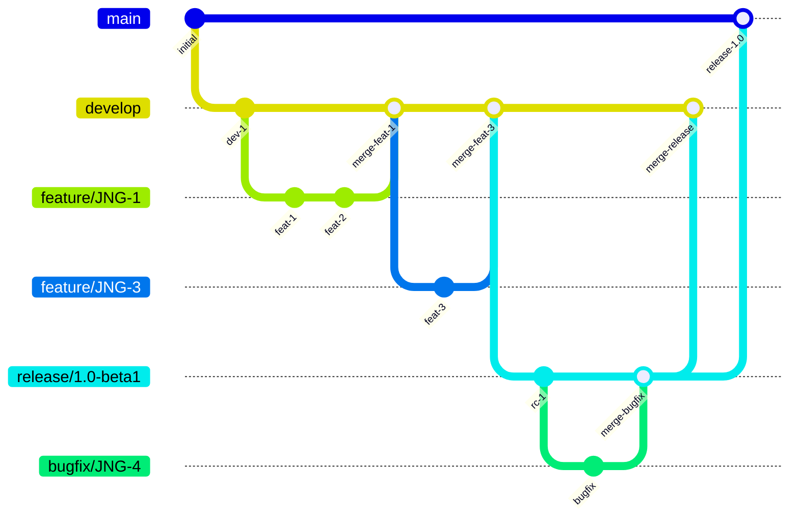
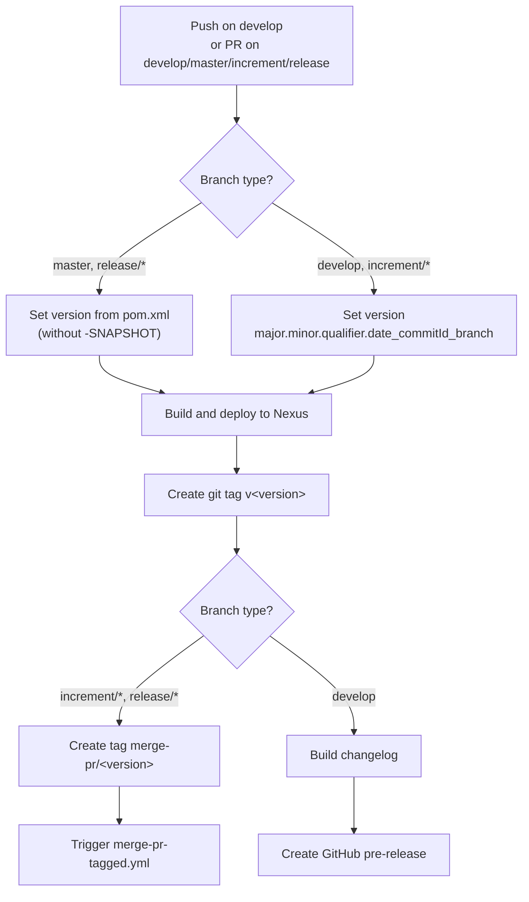
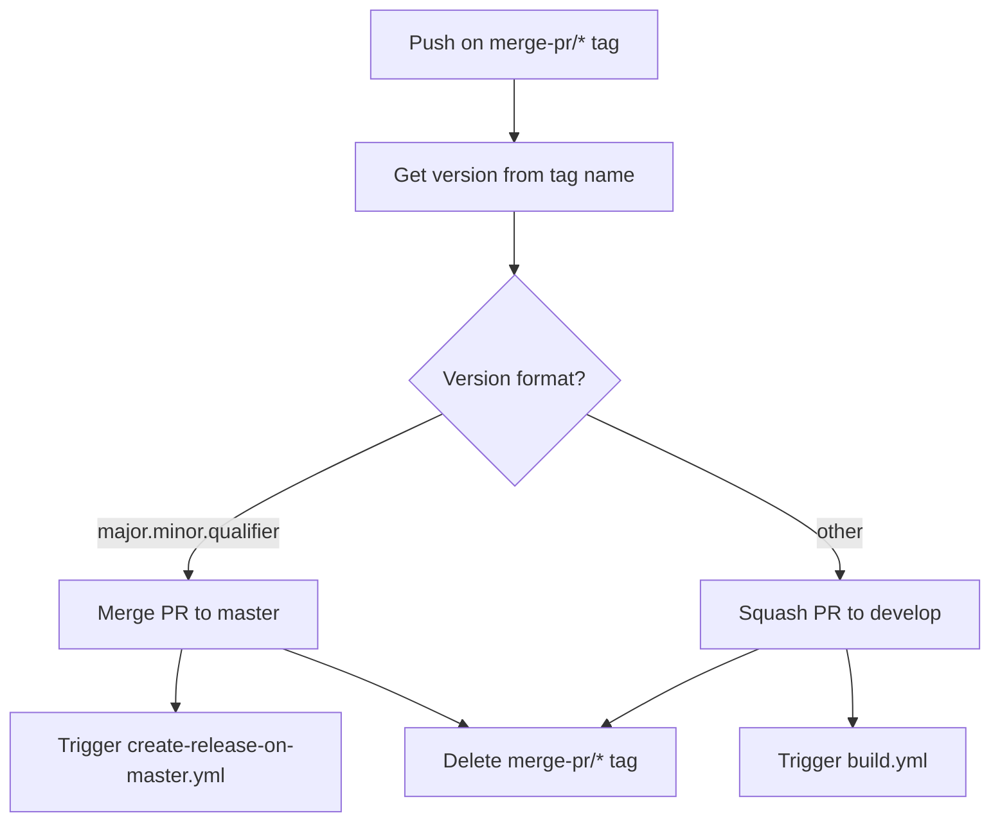
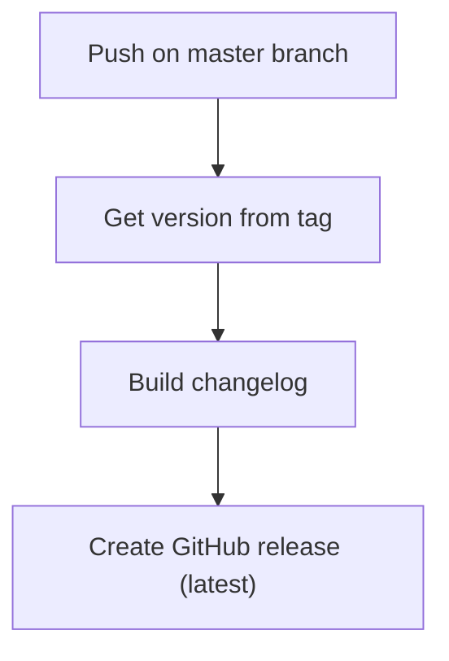
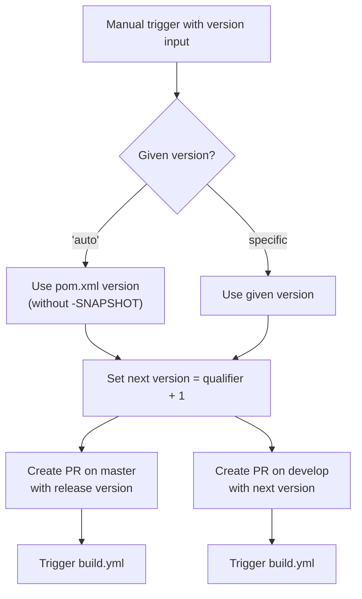

# Development Versioning and Branch Handling

## Branch Strategy

This project follows a GitFlow-based branching model. Each branch type has a specific purpose and naming convention.

### Branch Types

| Branch | Base | Purpose |
|--------|------|---------|
| `develop` | — | Main development branch with latest sources of the active version |
| `feature/JNG-NUMBER_short_summary` | `develop` | New features for the next version |
| `(release/)X.Y.Z` | `develop` | Release stabilization branches (the `release/` prefix is reserved for CI) |
| `bugfix/JNG-NUMBER_short_summary` | release branch | Fixes applied during release testing; must be merged to both release and newer develop branches |
| `support/JNG-NUMBER_short_summary` | release branch | Minor changes for a previous release; merged back to the release branch |
| `master` | — | Latest released sources of the active version |
| `hotfix/JNG-NUMBER_short_summary` | `master` | Urgent fixes applied to both release and master branches |

## Version Numbers

Versioning follows semantic versioning with these rules:

- **Feature branches** — do not change version numbers
- **Develop branch** — increment the 2nd number when a release branch is started
- **Bugfix branches** — do not change version numbers (applied to release branches before merging to master)
- **Support branches** — increment the 3rd number when started; merged back to the release branch without merging to master
- **Hotfix branches** — increment the 4th number when started; applied to both release and master branches

## GitHub Actions CI/CD Workflows

The project uses several interconnected GitHub Actions workflows.

### build.yml — Main Build Pipeline

### merge-pr-tagged.yml — PR Merge Automation

### create-release-on-master.yml — Release Creation

### release.yml — Manual Release

## Development Rules

> **Important:** There is no commit without a ticket number. Every pull request and commit must reference a JIRA ticket in the format `JNG-xxx`.

Issue tracking is done via [JIRA](https://blackbelt.atlassian.net/jira/dashboards).
