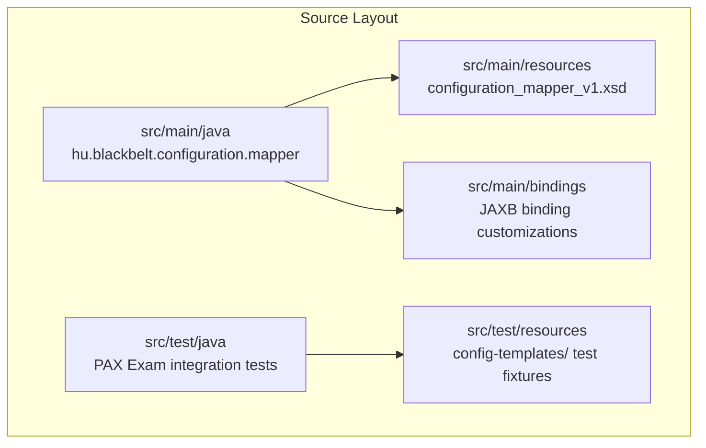
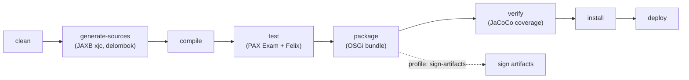

# Contributing to OSGi Configuration Mapper

## Prerequisites

Your development environment must meet the requirements described in the parent project's [CONTRIBUTING guide](https://github.com/BlackBeltTechnology/judo-community/blob/develop/CONTRIBUTING.adoc). In particular, ensure you have:

- **Java 21** JDK
- **Maven 3.9.4+** (or use the included `./mvnw` wrapper)

## Project Structure

This is a single-module Maven project that produces an OSGi bundle (`bundle` packaging). The main source code lives in the `hu.blackbelt.configuration.mapper` package.



## Build Commands

Run tests only:

```sh
mvn clean test
```

Full build (compile, test, package, install to local repo):

```sh
mvn clean install
```

Run a single test class:

```sh
mvn test -Dtest=DefaultTemplatedConfigSetTest
```

## Build Lifecycle



## Submitting an Issue

Before filing a new issue, search the [issue tracker](https://github.com/BlackBeltTechnology/osgi-configuration-mapper/issues) — your problem may already have been reported or resolved.

When reporting a bug, include:

- Output of `java -version` and `mvn -version`
- The `pom.xml` or `.flattened-pom.xml` if relevant
- A minimal reproducible scenario — this is essential for maintainers to confirm and fix the bug efficiently

File new issues using the [issue form](https://github.com/BlackBeltTechnology/osgi-configuration-mapper/issues/new/choose).

## Submitting a Pull Request

This project follows [GitHub's standard forking model](https://guides.github.com/activities/forking/). Fork the repository, make your changes, and submit a pull request.
