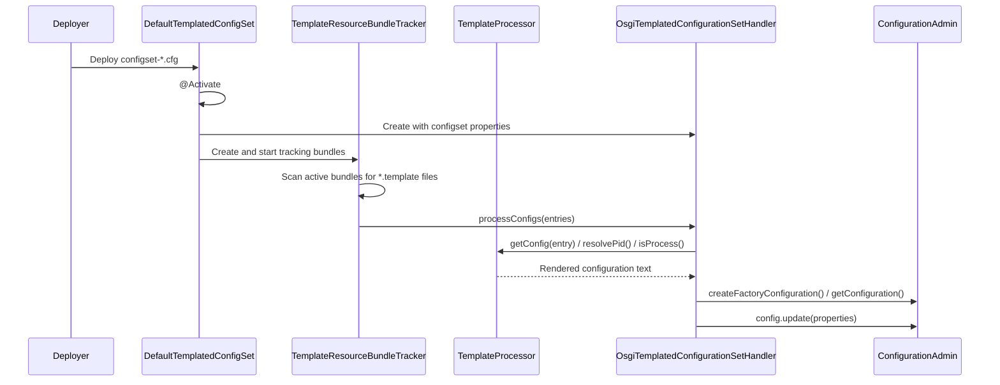
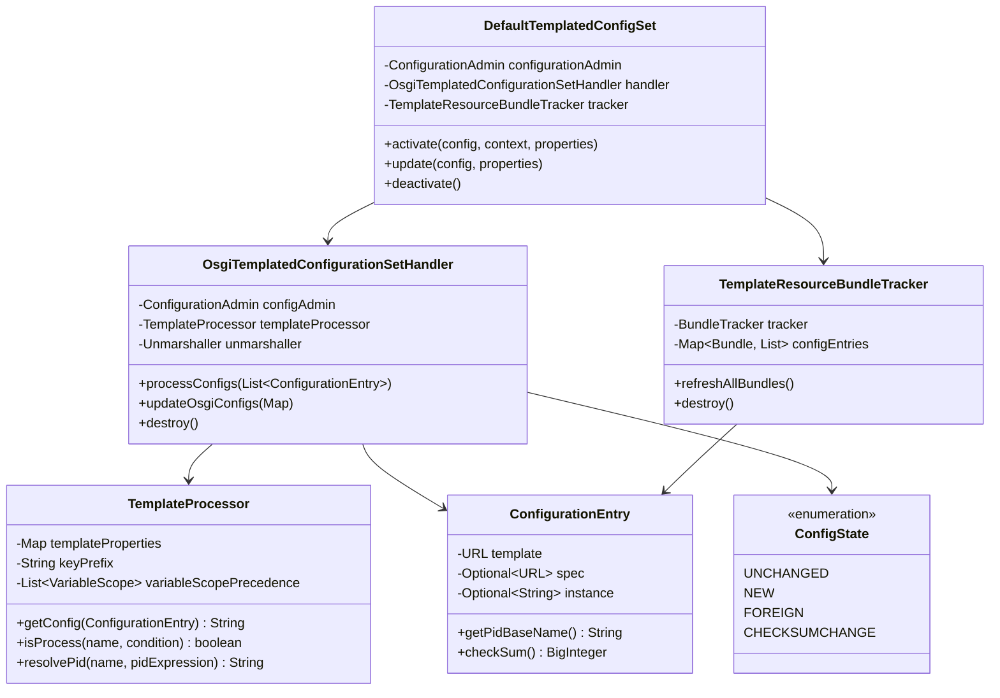

# OSGi Configuration Mapper

## Overview

The OSGi Configuration Mapper is a runtime component that simplifies managing complex OSGi configurations. Instead of configuring each OSGi component individually, you define all your configuration values in a single file (a "configset"), and the mapper distributes those values to multiple OSGi components through Freemarker templates.

This is particularly useful when many OSGi services share common configuration values (database URLs, credentials, feature flags, etc.) — you define them once and template them everywhere.

## How It Works

The mapper operates through a pipeline of three collaborating components:

1. **ConfigSet activation** — An OSGi Declarative Services component (`DefaultTemplatedConfigSet`) activates when a `configset-*.cfg` file is deployed. This file contains all the shared configuration variables.
2. **Bundle scanning** — A `TemplateResourceBundleTracker` watches all active OSGi bundles for template files (`*.template`) inside a configurable path (default: `/config-templates`).
3. **Template processing** — For each discovered template, the `TemplateProcessor` renders it using Freemarker with the configset variables, and the `OsgiTemplatedConfigurationSetHandler` pushes the resulting configuration into OSGi's `ConfigurationAdmin`.



## Component Architecture



## Configuration Options

The configset component (`DefaultTemplatedConfigSetConfig`) exposes these OSGi MetaType properties:

| Key | Name | Default | Description |
|-----|------|---------|-------------|
| `templatePath` | Template path | `/config-templates` | Directory path monitored inside bundles for template files |
| `envPrefix` | Environment prefix | _(undefined)_ | Prefix for environment variables. E.g., with prefix `X_`, the variable `X_PART1_PART2` becomes `part1Part2` in templates |
| `variableScopePrecedence` | Variable scope precedence | `osgi,environment,system` | Comma-separated list of variable scopes, ordered from lowest to highest priority |

## Template Variables

Variables in templates come from three scopes, merged according to the `variableScopePrecedence` setting (later entries override earlier ones):

| Scope | Source | Access in template |
|-------|--------|--------------------|
| `osgi` | ConfigSet properties (`configset-*.cfg`) | `${variableName}` |
| `environment` | OS environment variables | `${environment.VARIABLE_NAME}` (direct) or `${variableName}` (with prefix mapping) |
| `system` | JVM system properties (`-D...`) | `${system.propertyName}` (direct) or `${propertyName}` (merged) |

> **Note:** Dots (`.`) are replaced with underscores (`_`) in all variable names because Freemarker does not support dots in template variable names.

Environment variables with a configured prefix are transformed from `UPPER_SNAKE_CASE` to `lowerCamelCase` after stripping the prefix. For example, with prefix `X_`:
- `X_DATABASE_URL` becomes `databaseUrl`

## Template File Naming and Extensions

Template files must be placed in the `templatePath` directory inside OSGi bundles. The file naming determines how configurations are created:

| Pattern | Behavior |
|---------|----------|
| `pid.template` | Creates a single configuration with `pid` as the PID |
| `pid-instance.template` | Creates a configuration instance named `instance` using `pid` as the factory PID |

### XML Extension Files

An optional XML file (following the [configuration_mapper_v1.xsd](src/main/resources/configuration_mapper_v1.xsd) schema) can override default instantiation behavior. The XML file name must be `pid.xml`.

The XML schema supports:
- **`factoryPid`** — Override or dynamically compute the factory PID (Freemarker expressions supported when containing `$`)
- **`condition`** — A Freemarker boolean expression controlling whether the component instance is created

### Instantiation Rules

The interaction between template naming and XML configuration:

| | Empty template instance name | Non-empty template instance name |
|---|---|---|
| **Missing factory PID in XML** | Single configuration created | No configuration created |
| **Constant factory PID in XML** | No configuration created | Only matching instances created |
| **Expression factory PID in XML** | All instances created | Only matching instances created |

> **Note:** A factory PID is treated as an expression if it contains a `$` character.

If a template has an instance name but no XML file exists, the factory PID pattern is used automatically.

## Including Configuration in Apache Karaf

To include a default configset in a Karaf feature, package the configuration file as a Maven artifact and reference it from your feature definition:

```xml
<!-- In Karaf feature.xml -->
<feature name="my-app" version="${project.version}">
    <configfile override="false" finalname="/deploy/configset-myapp.cfg">
        mvn:${project.groupId}/my-config/${project.version}/cfg/default
    </configfile>
</feature>
```

This requires setting up `maven-resources-plugin` and `build-helper-maven-plugin` to package and attach the `.cfg` file as a classified artifact. See the project's original documentation for the full Maven plugin configuration.

## Dependency Graph

```mermaid
graph LR
    subgraph External Dependencies
        OSGi[OSGi Core 6.0.0 & Compendium]
        CM[OSGi ConfigurationAdmin]
        FM[Freemarker 2.3.28]
        JAXB[JAXB API 2.2]
        Guava[Google Guava 30.0]
        Lombok[Lombok 1.18.34]
    end

    subgraph OSGi Configuration Mapper
        DCS[DefaultTemplatedConfigSet]
        Handler[OsgiTemplatedConfigurationSetHandler]
        TP[TemplateProcessor]
        BT[TemplateResourceBundleTracker]
    end

    DCS -->|@Reference| CM
    DCS --> OSGi
    Handler --> CM
    Handler --> JAXB
    TP --> FM
    TP --> Guava
    BT --> OSGi
    DCS -.->|compile-time| Lombok
```
